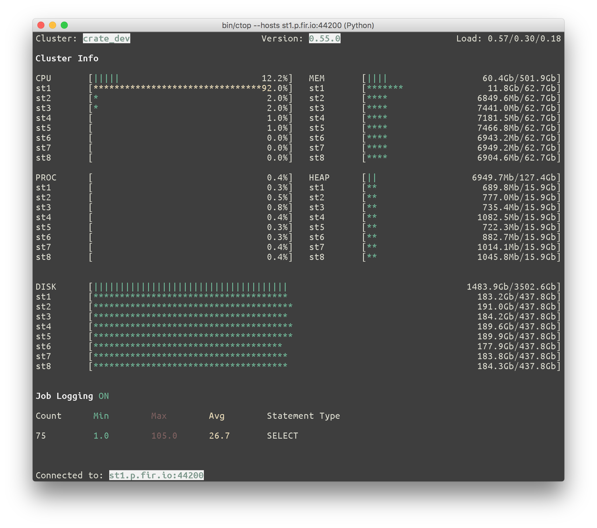

=====
cstat
=====

*A visual stat tool for CrateDB clusters.*

``cstat`` is ispired by the awesome interactive process monitoring tool htop_.
``cstat`` should be a similar tool to iostat_, but for monitoring CrateDB_
clusters.

Installation
============

Right now, ``stat`` is only available from Github_. Therefore you need to
checkout the repository and run ``pip install`` on the local directory.

::

    git clone https://github.com/chaudum/crate-top.git cstat
    cd cstat
    python3.4 -m venv env
    source ./env/bin/activate
    pip install -e .

``cstat`` requires **Python 3.6** or greater and can connect to **CrateDB
2.x**.

Usage
=====

After installation you can monitor CrateDB running on localhost with default
configuration by invoking the following command::

    >>> cstat --user crate

A full list of command line arguments are listed when invoking ``cstat`` with
the ``--help`` argument::

    >>> cstat --help
    usage: cstat [-h] [--host HOST] [--port PORT] [--interval INTERVAL]
                 [--user USER] [--version]

    A visual stat tool for CrateDB clusters

    optional arguments:
      -h, --help            show this help message and exit
      --host HOST, --crate-host HOST
                            CrateDB host to connect to
      --port PORT, --psql-port PORT
                            PSQL port of CrateDB host
      --interval INTERVAL, --refresh-interval INTERVAL
                            amount of time in seconds between each update
      --user USER, --db-user USER
                            database user
      --version             show program's version number and exit

By default ``cstat`` connects to ``localhost`` on port ``5432`` if not
otherwise specified.

Keyboard Shortcuts
==================

- ``0``  ... toggle cluster info
- ``1``  ... show utilization for CPU, process, memory, heap and disk
- ``2``  ... show I/O statistics for network and disk
- ``3``  ... show aggregated query duration based on jobs_log_
- ``x``  ... toggle nodes/aggregation view
- ``f3`` ... enable/disable job logging (this also sets the ``stats.jobs_log``
  cluster setting)

Known Issues
============

- Small terminal sizes will raise CanvasErrors because of content overflow.

Todo
====

- [x] display disk usage
- [x] display disk i/o
- [x] display network i/o
- [x] display node names in detail views
- [x] use asyncio to perform http requests
- [x] coloring of i/o stats
- [ ] responsive i/o widget

.. _htop: http://hisham.hm/htop/
.. _iostat: http://linux.die.net/man/1/iostat
.. _CrateDB: https://crate.io
.. _aiopg: https://github.com/aio-libs/aiopg
.. _Github: https://github.com/chaudum/crate-top
.. _jobs_log: https://crate.io/docs/reference/en/latest/configuration.html#collecting-stats
